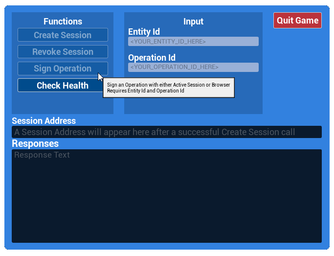

# beam-sdk-unreal-example

A minimal working example of how to interact with the BeamClient in the beam-sdk-unreal plugin.

This demo integrates [Beam SDK Unreal](https://github.com/BuildOnBeam/beam-sdk-unreal) to showcase how you can create an active session and use it to sign an operation.

When running the demo, you will be greeted by a panel where you can interface with the Beam API:
 

To create a session, enter a player name into the **Entity ID** box, and click **Create Session**.

To sign an operation, enter an **Operation ID** into the specified box, and click **Sign Operation**.

Note: The example Blueprints were created in UE 5.2.1, so only versions newer than that are likely to work with this demo.

## Docs
To read up on Sessions and Operations, please visit or [Player API docs](https://docs.onbeam.com/service/introduction-player-api).

## Setup

### Prerequisites
The [beam-sdk-unreal](https://github.com/BuildOnBeam/beam-sdk-unreal) repo is included as a submodule in this git repository under /Plugins/BeamSDK/.

If no files are present in this `/Plugins/BeamSDK/` directory, run this command at the project root to pull the submodule:
> git submodule init

Some git clients automatically prompt you to pull submodules when cloning a repository. If you are using one of these clients, you may not need to run the above command.

### Unreal Setup

1. Create a DefaultSecrets.ini file in the Config directory
   1. Add this section to the file: `[/Script/BeamExample.ExampleGameInstance]`
   2. Add this line to the new section: `BeamApiKey=YOUR_API_KEY`
   3. Replace `YOUR_API_KEY` above with your publishable Beam API key
   4. Note: You can invent your own system for injecting the BeamApiKey, this was done to keep the key out of source control through the .gitignore.
2. Right-click the .uproject file and select "Generate Visual Studio project files"
   1. If this doesn't appear as an option, you will need to install Unreal Engine through the Epic Games Launcher
3. Double-click the .sln file to open it in your IDE
4. Build & Run

## Usage

* `UExampleGameInstance` is the global singleton that holds the BeamClient instance
* `UExampleWidget` is the cpp class that the UI invokes
* `WBP_BeamDialog` is the blueprint widget that the UI is built in
* Additional usages of API calls can be found in the `/ExampleAPIs/` directory

## BeamClient
The base of entire SDK is BeamClient class. It's a class that extends UObject so it needs to be initialized via GameInstance or dependency injection framework of your choosing. 
```cpp
BeamStorage = UBeamSaveGameStorage::LoadOrCreate();
BeamClient = NewObject<UBeamClient>(this)
             ->SetBeamApiKey(BeamApiKey)
             ->SetEnvironment(EBeamEnvironment::Testnet)
             ->SetDebugLogging(true)
             ->SetStorage(BeamStorage);
```
You can see an example of initializing the `BeamClient` in [ExampleGameInstance.cpp](https://github.com/BuildOnBeam/beam-sdk-unreal-example/blob/fed9095eddbad6d6b1af1f49f12bb187733930ac/Source/BeamExample/ExampleGameInstance.cpp#L24)

## Session Creation
To create a session, you can enter a user name in the `Entity Id` field, then press `Create Session` which will open the browser for the User to perform a social login. You will receive a callback with result of signing via Beam SDK.
You can see an example of `CreateSession` in [ExampleWidget.cpp](https://github.com/BuildOnBeam/beam-sdk-unreal-example/blob/fed9095eddbad6d6b1af1f49f12bb187733930ac/Source/BeamExample/ExampleWidget.cpp#L7)

## Signing Operations
When performing an on-chain action in Beam Player API, you receive an Operation object in return. In order to actually perform the operation, you need to give us the `Operation Id`.
To sign an operation, you can enter the operation ID in the `Operation Id` field, ensure that `Entity Id` field is also set, then press `Sign Operation`.
We will either use an existing active session or open a browser for user to sign the operation.
An operation can consist of multiple on-chain transactions that need signing, we will handle all of that for you.
You can see an example of `SignOperation` in [ExampleWidget.cpp](https://github.com/BuildOnBeam/beam-sdk-unreal-example/blob/fed9095eddbad6d6b1af1f49f12bb187733930ac/Source/BeamExample/ExampleWidget.cpp#L58)
